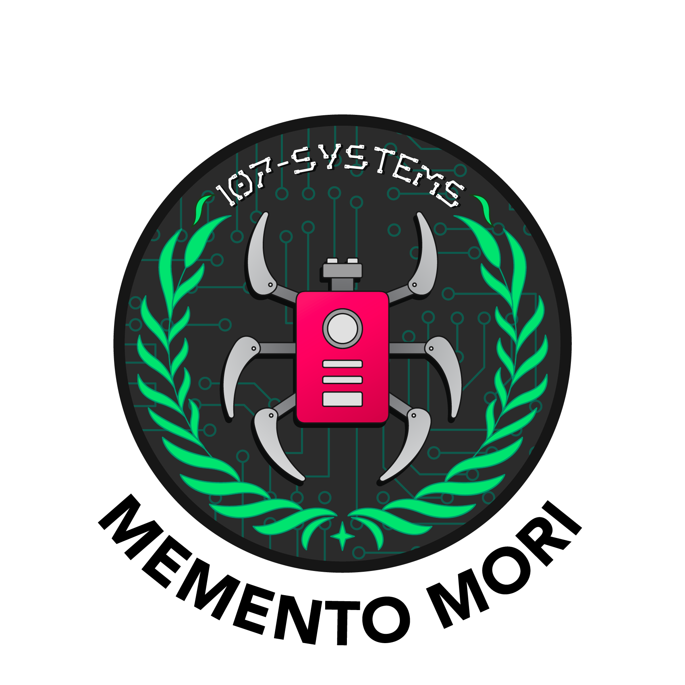

.github
=======
Repository containing default files for all [107-Systems](https://107-systems.org/) repositories.

  

All artwork is copyright © [LXRobotics GmbH](https://www.lxrobotics.com/). All rights reserved.

  

### Arduino Library CI Status
| Library | ✔️ / ❌ |
|:-:|:-:|
| [107-Arduino-BMP388](https://github.com/107-systems/107-Arduino-BMP388) |  |
| [107-Arduino-BoostUnits](https://github.com/107-systems/107-Arduino-BoostUnits) |  |
| [107-Arduino-Debug](https://github.com/107-systems/107-Arduino-Debug) |  |
| [107-Arduino-MCP2515](https://github.com/107-systems/107-Arduino-MCP2515) |  |
| [107-Arduino-NMEA-Parser](https://github.com/107-systems/107-Arduino-NMEA-Parser) |  |
| [107-Arduino-Sensor](https://github.com/107-systems/107-Arduino-Sensor) |  |
| [107-Arduino-TMF8801](https://github.com/107-systems/107-Arduino-TMF8801) |  |
| [107-Arduino-Cyphal](https://github.com/107-systems/107-Arduino-Cyphal) |  |
| [107-Arduino-TCS3472](https://github.com/107-systems/107-Arduino-TCS3472) |  |
| [107-Arduino-TSL2550](https://github.com/107-systems/107-Arduino-TSL2550) |  |
| [107-Arduino-AS504x](https://github.com/107-systems/107-Arduino-AS504x) |  |
| [107-Arduino-APDS-9950](https://github.com/107-systems/107-Arduino-APDS-9950) |  |
